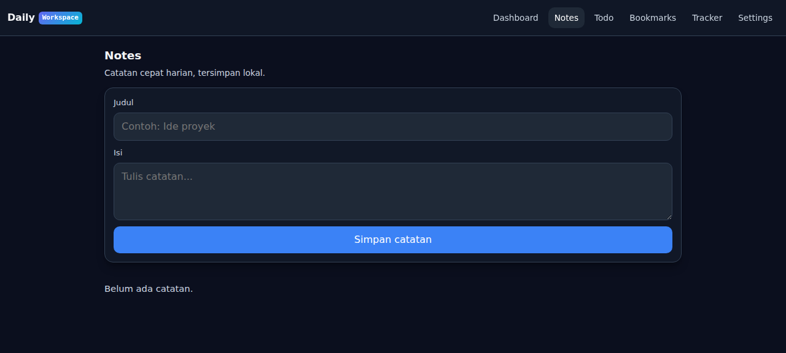

# DailyWorkspace

Workspace harian modular untuk produktivitas: catatan, todo, bookmark, dan tracker pengeluaran/pemasukan dalam satu antarmuka.

## Fitur
- Dashboard ringkasan harian
- Notes: catatan cepat
- Todo: tugas + prioritas + centang selesai
- Bookmarks: link penting
- Tracker: pengeluaran dan pemasukan
- Settings: tema gelap/terang, prioritas default, mata uang
- Semua data tersimpan di localStorage
- Responsif untuk HP dan desktop
- Tanpa login, offline-ready

## Live
- https://dailyworkspace.pages.dev

## Cara pakai
1. Buka live URL
2. Pilih module dari navbar
3. Tambah data dari form di setiap module
4. Data tersimpan otomatis di browser

## Target user
- Freelancer/remote worker
- Mahasiswa
- Pengguna yang butuh tool produktivitas simpel tanpa login

## Teknis
- Pure HTML/CSS/JS
- Cloudflare Pages
- GitHub: https://github.com/Zwart04/dailyworkspace
